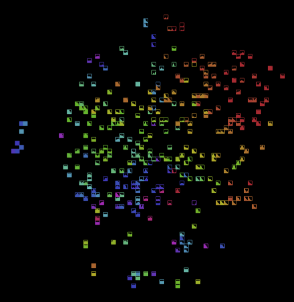

# FluidCorpusMap

FluidCorpusMap is a SuperCollider library for visualizing sound collections using audio analysis and dimensionality reduction.

## Install
FluidCorpusMap is based on the [Fluid Corpus Manipulation plugins for Supercollider](https://github.com/flucoma/flucoma-sc). Make sure you have these installed, then just copy the FCMv2 folder to the SuperCollider Extensions folder.

## Use

The library can be use to generate plots of sound collections in different ways. The collection can be extracted by segmentation of a longer recording.

Here is an example:
```
(
var win = Window.new("", Rect(0, 0, 800, 800));
var fcm = FCM.new();
var plot;

fcm.settings.reduction.useGrid = true;
fcm.settings.reduction.gridSample = 3;
fcm.settings.analysis.positionFtr = \mfcc;
fcm.settings.analysis.shapeFtr = \loudness;
fcm.settings.analysis.colorFtr = \spectral_centroid;
fcm.settings.reduction.useGrid = true;
fcm.settings.reduction.gridSample = 4;
fcm.settings.display.iconSize = 10;
fcm.settings.display.iconStyle = \fill;

fcm.addFolder("/path/to/files/wav")
.makeIndex()
.run{
	plot = FCMPlotView.new(win, win.bounds, fcm);
	win.front;
})

```
And the resulting plot using a collection of ~1500 sounds:



For more examples, check the examples folder.
